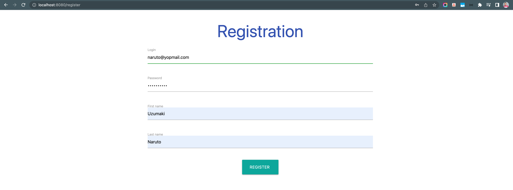
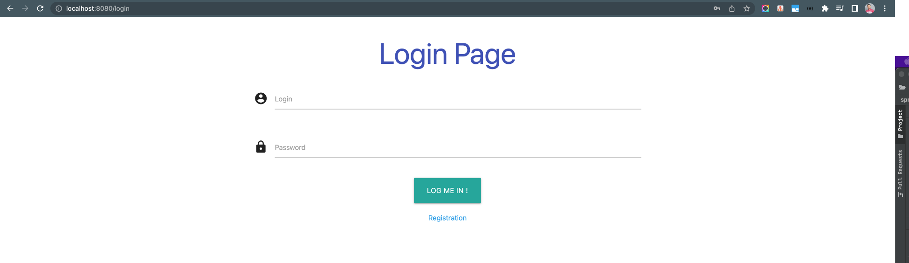

# springboot-mycars

### Things to do list:

1. Clone this repository: `git clone https://github.com/hendisantika/springboot-mycars.git`
2. Navigate to the folder: `cd springboot-mycars`
3. Replace the MySQL credentials on application.properties file with your own
4. Run the application: `mvn clean spring-boot:run`
5. Open your favorite browser: http://localhost:8080

### Image Screen shot

Register Page

Login Page

